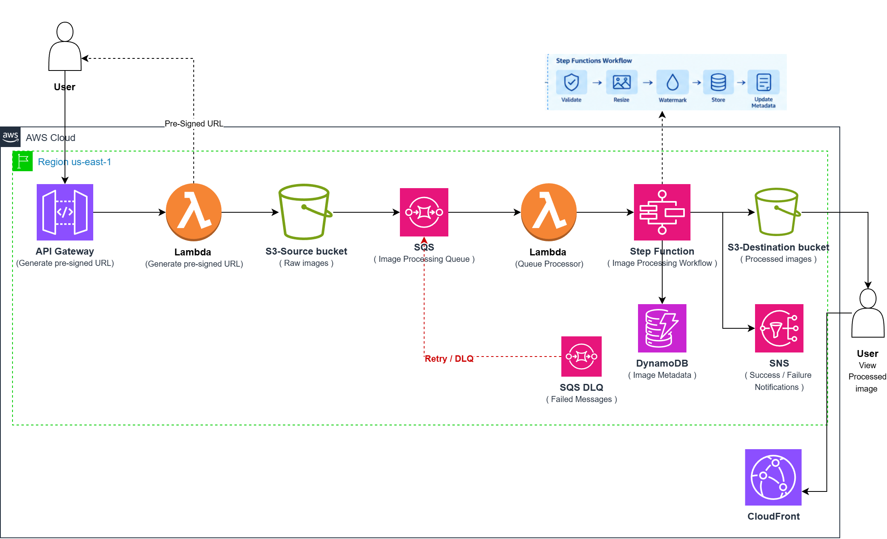
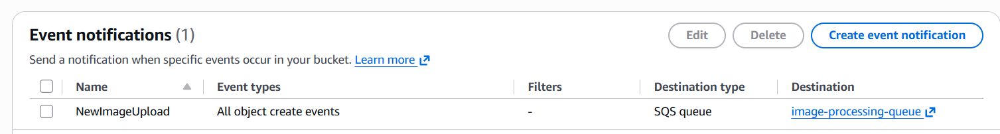
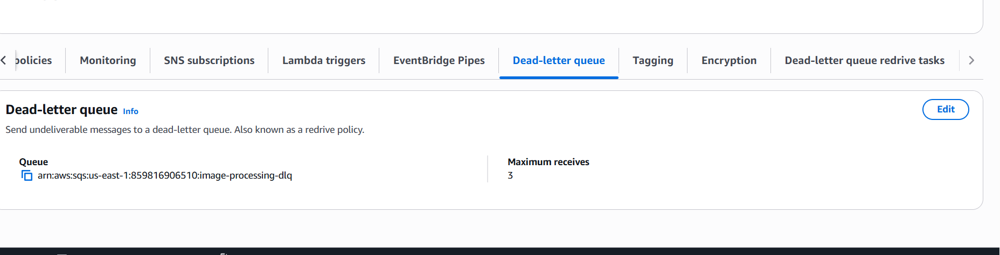
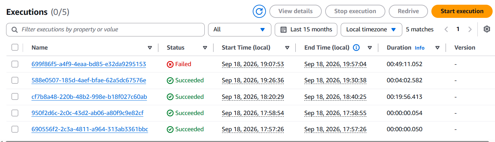
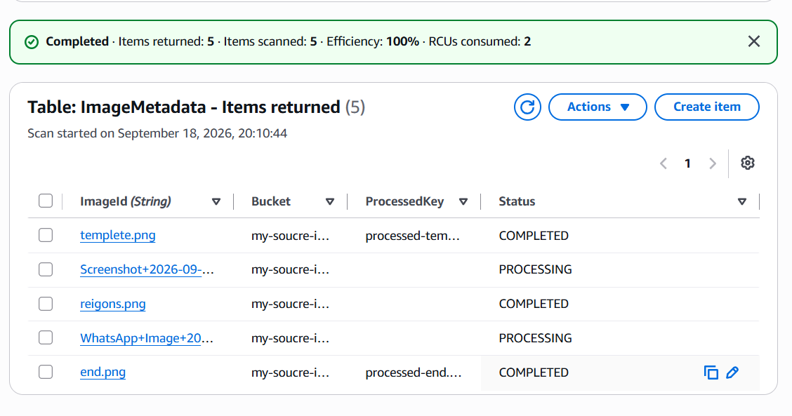

# Serverless Image Processing Pipeline with S3, SQS & Lambda

A production-inspired serverless image processing pipeline built on AWS.

The system allows users to upload images securely using Amazon S3 pre-signed URLs. Uploaded images generate events that are decoupled through Amazon SQS before being processed asynchronously by AWS Lambda and orchestrated through AWS Step Functions.

Processed images are stored in a separate S3 destination bucket and delivered globally through Amazon CloudFront. Amazon DynamoDB stores image metadata and processing status, while Amazon SNS provides success/failure notifications. Failed messages are isolated using an Amazon SQS Dead-Letter Queue (DLQ).

---

## Architecture



The architecture follows an **event-driven, asynchronous, and serverless design**.

### High-Level Flow

```text
User
  │
  ▼
API Gateway
  │
  ▼
Lambda
  │
  │ Generate Pre-signed URL
  ▼
S3 Source Bucket
  │
  │ ObjectCreated Event
  ▼
SQS Processing Queue
  │
  │ Lambda polls queue
  ▼
Lambda
  │
  ▼
Step Functions
  │
  ├── Validate Image
  ├── Resize Image
  ├── Watermark Image
  ├── Extract Metadata
  ├── Store Processed Image
  └── Update Processing Status
           │
           ├──────────► DynamoDB
           │
           └──────────► SNS
                          │
                          ├── Success Notification
                          └── Failure Notification

Failed SQS Messages
        │
        ▼
    SQS DLQ

Processed Images
        │
        ▼
S3 Destination Bucket
        │
        ▼
CloudFront
        │
        ▼
      User
```

---

# 1. Project Objectives

The main objective of this project is to design and implement a **scalable, resilient, and fully serverless image-processing architecture** using AWS managed services.

The project demonstrates how multiple AWS services can work together to build an asynchronous event-driven application without managing servers.

### Main objectives

* Build an event-driven image-processing pipeline.
* Secure image uploads using S3 pre-signed URLs.
* Decouple image uploads from processing using Amazon SQS.
* Process images asynchronously using AWS Lambda.
* Orchestrate multiple processing steps using AWS Step Functions.
* Store processed images in a dedicated S3 bucket.
* Store image metadata and processing status in DynamoDB.
* Handle processing failures using SQS retries and a Dead-Letter Queue.
* Send completion/failure notifications through SNS.
* Deliver processed images globally using CloudFront.
* Apply S3 lifecycle policies for storage and cost optimization.
* Apply least-privilege IAM permissions between AWS services.

---

# 2. Why This Architecture?

A simple image-processing application could process an uploaded image immediately.

However, synchronous processing introduces several problems:

* The user may need to wait for processing to finish.
* A temporary processing failure can affect the upload request.
* Large numbers of uploads can overload the processing layer.
* There is no reliable buffer between uploads and processing.
* Retry and failure handling become more difficult.

This architecture solves these problems by introducing **asynchronous processing and decoupling**.

```text
User Upload
     │
     ▼
S3
     │
     ▼
SQS
     │
     ▼
Processing
```

Amazon SQS acts as a buffer between the image-upload system and the processing system.

This allows the processing layer to consume messages independently from the upload rate.

---

# 3. End-to-End Request Flow

## Step 1 — Request a Pre-signed URL

The user sends an upload request through API Gateway.

```text
User
  │
  ▼
API Gateway
  │
  ▼
Lambda
```

The Lambda function generates a temporary S3 pre-signed URL.

The user can then upload the image directly to S3 without sending the image through API Gateway or Lambda.

### Benefits

* Secure temporary access to S3.
* No AWS credentials are exposed to the user.
* Large files do not need to pass through Lambda.
* Reduces unnecessary API Gateway and Lambda traffic.

---

# 4. Image Upload to S3

The image is uploaded directly to the **Source S3 Bucket** using the pre-signed URL.

```text
User
  │
  │ PUT image
  ▼
S3 Source Bucket
```

The source bucket is responsible for storing the original/raw images.

Example:

```text
source-bucket/
└── uploads/
    ├── image-001.jpg
    ├── image-002.jpg
    └── image-003.jpg
```

The bucket can use:

* Block Public Access
* Bucket policies
* Encryption
* Lifecycle rules
* Event notifications
* Versioning if required

The source bucket should remain private.

---

# 5. S3 Event Notification

When a new image is uploaded, S3 generates an `ObjectCreated` event.

```text
S3 Source Bucket
       │
       │ ObjectCreated
       ▼
SQS Processing Queue
```

The event contains information about the uploaded object, such as:

* Bucket name
* Object key
* Event type
* Timestamp
* Object information

The event allows the processing pipeline to start automatically without polling S3.

---

# 6. Amazon SQS — Decoupling Layer

Amazon SQS is used as the messaging and buffering layer.

```text
S3
 │
 ▼
SQS
 │
 ▼
Lambda
```

### Why SQS?

SQS provides:

* Decoupling
* Asynchronous processing
* Message buffering
* Automatic retries
* Failure isolation
* Better resilience during traffic spikes

For example, if 1,000 images are uploaded in a short period, the images do not all need to be processed simultaneously.

Instead:

```text
1000 Images
     │
     ▼
SQS Queue
     │
     ▼
Lambda consumers
     │
     ▼
Processing
```

The queue absorbs the temporary traffic spike.

---

# 7. SQS Dead-Letter Queue

A Dead-Letter Queue is configured to handle messages that repeatedly fail processing.

Example:

```text
SQS Main Queue
      │
      │ Processing failure
      ▼
    Retry
      │
      ▼
    Retry
      │
      ▼
    Retry
      │
      │ maxReceiveCount exceeded
      ▼
    SQS DLQ
```

The DLQ prevents permanently failing messages from continuously being retried.

Examples of possible failures:

* Corrupted image
* Unsupported image format
* Lambda processing error
* Missing object
* Invalid metadata
* Unexpected application error

This improves the reliability and observability of the system.

---

# 8. Lambda — Queue Processor

A Lambda function is configured to consume messages from the SQS queue.

```text
SQS
 │
 ▼
Lambda
 │
 ▼
Step Functions
```

The Lambda function retrieves the S3 object information from the SQS message and starts the corresponding Step Functions execution.

This creates a clean separation between:

**Message consumption**

and

**Image-processing workflow orchestration**

---

# 9. AWS Step Functions

Step Functions orchestrates the image-processing workflow.

Example workflow:

```text
Start
  │
  ▼
Validate Image
  │
  ▼
Resize Image
  │
  ▼
Watermark Image
  │
  ▼
Extract Metadata
  │
  ▼
Store Processed Image
  │
  ▼
Update DynamoDB
  │
  ▼
Success
```

Step Functions is useful because the application contains multiple processing stages.

Instead of implementing the entire workflow inside one large Lambda function, each logical step can be represented separately.

### Benefits

* Clear workflow visualization
* Service orchestration
* Error handling
* Retry policies
* Conditional branching
* Easier debugging
* Better separation of responsibilities

---

# 10. Image Processing with Lambda

Lambda performs the image-processing operations.

The processing workflow can include:

### Resize

Generate a smaller version of the original image.

Example:

```text
Original
4000 × 3000

       ↓

Thumbnail
800 × 600
```

### Watermark

Apply a predefined watermark to the processed image.

### Metadata Extraction

Extract information such as:

* Width
* Height
* Format
* File size
* Processing timestamp

---

# 11. Lambda Layers

Image-processing libraries can significantly increase the Lambda deployment package size.

To separate application code from dependencies, Lambda Layers can be used.

Example:

```text
Lambda Function
│
├── Application Code
│
└── Lambda Layer
      │
      └── Pillow / Sharp
```

This demonstrates how external dependencies can be packaged and reused.

The exact image-processing library depends on the Lambda runtime and implementation language.

---

# 12. Destination S3 Bucket

After processing is completed, the processed image is stored in a separate destination bucket.

```text
Source Bucket
     │
     ▼
Processing Pipeline
     │
     ▼
Destination Bucket
```

Example:

```text
destination-bucket/
└── processed/
    ├── image-001-thumbnail.jpg
    ├── image-001-watermarked.jpg
    └── image-002-thumbnail.jpg
```

Separating raw and processed objects provides a cleaner architecture and makes it easier to apply different:

* Access policies
* Lifecycle policies
* Storage classes
* Retention rules

---

# 13. DynamoDB — Image Metadata

Amazon DynamoDB stores image metadata and processing status.

Example item:

```text
{
  "imageId": "image-001",
  "fileName": "photo.jpg",
  "uploadTime": "2026-09-18T18:00:00Z",
  "width": 4000,
  "height": 3000,
  "status": "COMPLETED",
  "processedKey": "processed/image-001.jpg"
}
```

Possible status values:

```text
UPLOADED
PROCESSING
COMPLETED
FAILED
```

This allows the application to track the lifecycle of every image.

---

# 14. Amazon SNS — Notifications

SNS is used to notify subscribers about processing results.

```text
Step Functions
      │
      ├── SUCCESS
      │
      ▼
     SNS
      │
      ▼
Notification
```

Failure events can follow a similar path.

```text
Processing Failure
       │
       ▼
      SNS
       │
       ▼
Failure Notification
```

Possible notification:

```text
Image Processing Completed

Image: image-001.jpg
Status: COMPLETED
Output: processed/image-001.jpg
```

---

# 15. CloudFront — Global Content Delivery

CloudFront is placed in front of the processed-image S3 bucket.

```text
User
 │
 ▼
CloudFront
 │
 ▼
S3 Destination Bucket
```

CloudFront caches frequently requested images at edge locations.

### Benefits

* Lower latency for global users
* Reduced direct requests to S3
* Content caching
* Global distribution
* Better performance for frequently accessed images

The destination S3 bucket should remain private, with access controlled through the CloudFront architecture rather than making the bucket publicly accessible.

---

# 16. S3 Lifecycle Management

Lifecycle rules can automatically manage object storage over time.

Example:

```text
New Object
    │
    ▼
S3 Standard
    │
    │ After X days
    ▼
Infrequent Access
    │
    │ After Y days
    ▼
Expiration / Deletion
```

Lifecycle policies can be configured differently for:

* Original images
* Processed images
* Temporary objects

This helps reduce long-term storage costs.

---

# 17. Security Design

Security is implemented using AWS managed security controls.

### S3

* Block Public Access
* Bucket policies
* Encryption at rest
* Pre-signed URLs for temporary uploads

### IAM

Each Lambda function should have only the permissions it needs.

For example:

```text
Upload Lambda
 └── Permission to generate S3 upload URLs

Processing Lambda
 └── Permission to read required SQS messages
 └── Permission to start Step Functions

Processing Workflow
 ├── Read source S3 objects
 ├── Write destination S3 objects
 └── Update DynamoDB

Notification Component
 └── Permission to publish to SNS
```

This follows the **Principle of Least Privilege**.

---

# 18. Reliability and Fault Tolerance

The architecture uses multiple mechanisms to improve reliability.

### SQS Buffering

Protects the processing layer from sudden traffic spikes.

### Automatic Retries

Failed processing can be retried.

### Dead-Letter Queue

Messages that repeatedly fail are isolated.

### Step Functions Error Handling

Individual workflow steps can have retry and catch behavior.

Example:

```text
Resize
  │
  ├── Success → Continue
  │
  └── Failure
        │
        ├── Retry
        │
        └── Catch → Failure Handling
```

### Separate S3 Buckets

Raw and processed objects are isolated from each other.

---

# 19. Scalability

The architecture is designed to scale without manually managing servers.

```text
More Uploads
     │
     ▼
S3
     │
     ▼
SQS Queue
     │
     ▼
Lambda
     │
     ▼
Step Functions
```

SQS provides buffering while Lambda can process messages according to the available concurrency.

The architecture therefore separates:

```text
Upload Rate
     ≠
Processing Rate
```

This is one of the key advantages of asynchronous event-driven systems.

---

# 20. Observability

The system can be monitored using AWS monitoring and logging services.

Useful metrics and logs include:

### Lambda

* Invocation count
* Duration
* Errors
* Throttles
* Concurrent executions

### SQS

* Approximate number of messages visible
* Message age
* Messages sent
* Messages received

### Step Functions

* Successful executions
* Failed executions
* Execution history
* Execution duration

### DynamoDB

* Read/write activity
* Throttling
* Consumed capacity

CloudWatch Logs can be used to troubleshoot Lambda processing errors.

---

# 21. Testing the Architecture

The pipeline can be tested using the following scenario.

### Test 1 — Successful Processing

1. Request a pre-signed URL through API Gateway.
2. Upload an image to the source S3 bucket.
3. Verify the S3 event.
4. Verify that an SQS message is created.
5. Verify that Lambda receives the message.
6. Verify Step Functions execution.
7. Verify image processing.
8. Verify the processed image in the destination bucket.
9. Verify DynamoDB status becomes `COMPLETED`.
10. Verify SNS success notification.
11. Access the processed image through CloudFront.

Expected result:

```text
UPLOAD
  ↓
S3
  ↓
SQS
  ↓
Lambda
  ↓
Step Functions
  ↓
Processed S3 Object
  ↓
DynamoDB = COMPLETED
  ↓
SNS = SUCCESS
  ↓
CloudFront
```

---

## Test 2 — Processing Failure

Intentionally provide an invalid or unsupported image.

Expected behavior:

```text
S3
 ↓
SQS
 ↓
Lambda
 ↓
Processing Failure
 ↓
Retry
 ↓
Retry
 ↓
Retry
 ↓
DLQ
```

The failure should also be recorded in the application's status/notification flow.

---

# 22. AWS Services Used

| Service                | Purpose                                          |
| ---------------------- | ------------------------------------------------ |
| **Amazon S3**          | Store original and processed images              |
| **Amazon SQS**         | Decouple upload events from processing           |
| **Amazon SQS DLQ**     | Handle repeatedly failed messages                |
| **AWS Lambda**         | Serverless image processing and request handling |
| **AWS Lambda Layers**  | Package image-processing dependencies            |
| **AWS Step Functions** | Orchestrate the multi-step workflow              |
| **Amazon API Gateway** | Expose the upload API                            |
| **Amazon DynamoDB**    | Store image metadata and processing status       |
| **Amazon SNS**         | Send processing notifications                    |
| **Amazon CloudFront**  | Globally deliver processed images                |
| **AWS IAM**            | Control service-to-service permissions           |
| **Amazon CloudWatch**  | Logs, metrics, and monitoring                    |

---

# 23. Key Architecture Concepts Demonstrated

This project demonstrates several important AWS architecture concepts:

* Event-driven architecture
* Serverless architecture
* Asynchronous processing
* Loose coupling
* Message queuing
* Retry mechanisms
* Dead-Letter Queues
* Workflow orchestration
* Object storage
* CDN and edge caching
* No-server infrastructure
* Least-privilege IAM
* Pre-signed URLs
* Lifecycle management
* Failure isolation
* Horizontal scalability

---

# 24. Architecture Benefits

### Scalability

The architecture can handle variable workloads using managed AWS services.

### Resilience

SQS buffering, retries, DLQ, and Step Functions error handling improve failure recovery.

### Decoupling

The upload system does not need to wait for image processing to complete.

### Security

Images remain private and users receive temporary access through pre-signed URLs.

### Cost Efficiency

The architecture uses serverless services where resources are consumed on demand.

### Maintainability

The image-processing workflow is separated into logical components instead of one large application.

### Global Performance

CloudFront caches processed images closer to users around the world.

---

# 25. Project Structure

```text
serverless-image-processing/
│
├── README.md
│
├── architecture/
│   └── architecture-diagram.png
│
├── lambda/
│   ├── upload-url-generator/
│   └── queue-processor/
│
├── step-functions/
│   └── image-processing-workflow.json
│
├── infrastructure/
│   └── README.md
│
└── screenshots/
    ├── s3-event.png
    ├── sqs-dlq.png
    ├── step-functions.png
    └── processing-result.png
```

---

# 26. AWS Console Implementation Screenshots

The following screenshots document the actual implementation of the architecture in the AWS Console.

## 1. S3 Event Notification

This screenshot demonstrates the connection between the source S3 bucket and the SQS processing queue.



**Demonstrates:**

```text
S3 ObjectCreated
       ↓
SQS
```

---

## 2. SQS Queue and Dead-Letter Queue

This screenshot demonstrates the main processing queue, DLQ configuration, and retry/failure handling.



**Demonstrates:**

```text
SQS Main Queue
      ↓
Retries
      ↓
SQS DLQ
```

---

## 3. Step Functions Workflow

This screenshot demonstrates the actual image-processing workflow deployed in AWS.



**Demonstrates:**

```text
Validate
   ↓
Resize
   ↓
Watermark
   ↓
Store
   ↓
Update Metadata
```

---

## 4. Successful Processing Result

This screenshot demonstrates the final result of the pipeline, showing that an uploaded image was successfully processed and stored in the destination S3 bucket.



**Demonstrates the complete flow:**

```text
Upload
  ↓
S3
  ↓
SQS
  ↓
Lambda
  ↓
Step Functions
  ↓
Destination S3
```

---

# 27. Cost Considerations

The project is designed around AWS serverless services and can be tested with relatively small workloads.

For a learning project, usage should be kept low to remain within applicable AWS Free Tier limits.

To control costs:

* Use a small number of test images.
* Avoid unnecessary large image files.
* Monitor S3 storage.
* Monitor Lambda execution.
* Monitor Step Functions state transitions.
* Avoid unnecessary CloudFront usage.
* Delete resources that are no longer required.
* Configure S3 lifecycle rules where appropriate.
* Monitor AWS Billing and Free Tier usage.

**Important:** AWS Free Tier availability and limits can change, so the current AWS pricing and Free Tier documentation should be checked before deploying the project.

---

# 28. What I Learned

Through this project, I gained practical experience designing and implementing a serverless event-driven architecture on AWS.

### Technical Skills

* Designing serverless architectures
* Working with Amazon S3 events
* Implementing SQS-based decoupling
* Configuring SQS retries and DLQs
* Building Lambda-based processing
* Using Lambda Layers
* Designing Step Functions workflows
* Working with DynamoDB
* Implementing API Gateway integrations
* Using SNS notifications
* Configuring CloudFront
* Applying IAM least-privilege principles
* Implementing S3 lifecycle policies
* Troubleshooting distributed serverless workflows

### Architecture Skills

More importantly, the project demonstrates how to choose AWS services based on architectural requirements rather than using services independently.

For example:

```text
Need asynchronous processing?
        ↓
      SQS

Need workflow orchestration?
        ↓
  Step Functions

Need serverless compute?
        ↓
      Lambda

Need object storage?
        ↓
       S3

Need global content delivery?
        ↓
    CloudFront

Need metadata storage?
        ↓
    DynamoDB

Need failure isolation?
        ↓
      DLQ
```

---

# 29. Final Architecture

The final solution combines managed AWS services into an event-driven processing pipeline:

```text
                         ┌─────────────────┐
                         │      User       │
                         └────────┬────────┘
                                  │
                                  ▼
                         ┌─────────────────┐
                         │  API Gateway    │
                         └────────┬────────┘
                                  │
                                  ▼
                         ┌─────────────────┐
                         │     Lambda      │
                         │ Pre-signed URL  │
                         └────────┬────────┘
                                  │
                                  ▼
                         ┌─────────────────┐
                         │   S3 Source     │
                         │  Raw Images     │
                         └────────┬────────┘
                                  │
                            S3 Event
                                  │
                                  ▼
                         ┌─────────────────┐
                         │      SQS        │
                         │ Processing Queue │
                         └────────┬────────┘
                                  │
                                  ▼
                         ┌─────────────────┐
                         │     Lambda      │
                         │ Queue Processor │
                         └────────┬────────┘
                                  │
                                  ▼
                    ┌──────────────────────────┐
                    │     Step Functions      │
                    │                          │
                    │ Validate → Resize        │
                    │      → Watermark         │
                    │      → Metadata          │
                    │      → Store             │
                    └────────────┬─────────────┘
                                 │
                  ┌──────────────┼──────────────┐
                  ▼              ▼              ▼
             S3 Destination  DynamoDB         SNS
             Processed Image  Metadata      Notification
                  │
                  ▼
             CloudFront
                  │
                  ▼
                User


          Processing Failures
                  │
                  ▼
                SQS DLQ
```

---

# Conclusion

This project demonstrates a complete serverless image-processing pipeline using AWS managed services.

The architecture combines **event-driven design, asynchronous processing, workflow orchestration, failure handling, secure object storage, metadata management, notifications, and global content delivery**.

The key architectural principle is to keep the components loosely coupled:

```text
Upload
  ↓
Event
  ↓
Queue
  ↓
Processing
  ↓
Storage
  ↓
Delivery
```

This allows each component to scale and fail independently while maintaining a resilient and maintainable architecture.
